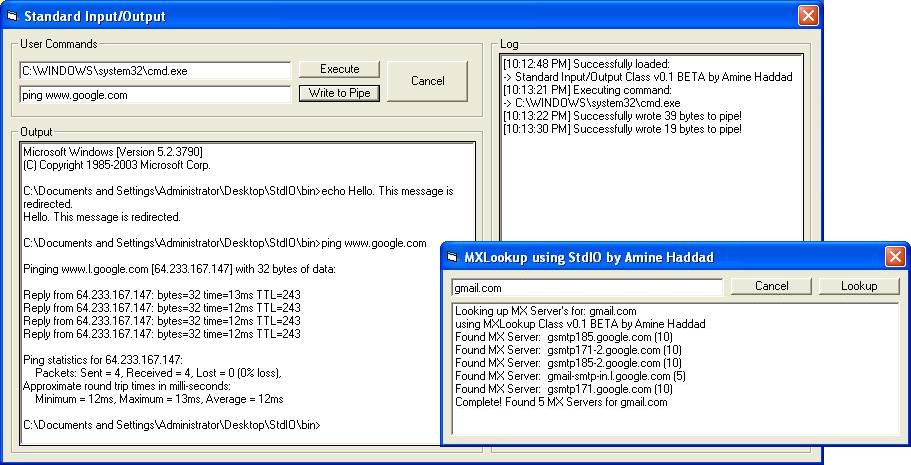



## CPU/User Friendly, Non\-Blocking StdIO \(Pipe Redirection\) w/ MX Lookup Example Included\!

### Description

This is User-Friendly, CPU-Friendly, NON-BLOCKING Standard Input-Output code to grab

output of a command line interface program, AND, for the first time ever (in open source in VB), to send input to it as well.

For example, when you go to start -&gt; run -&gt; cmd, you will notice that it opens up

and you can type stuff in it like ping www.google.com. Now that was done before (by me and a few others on the net in vb) that we can grab the output of the ping www.google.com, and then we would lose the console, but in this one, we run the console, and we send it ping www.google.com and it returns to normal so we can send it another command! This can be used with ANY program that can output to DOS (except a few that use direct CON output).

Also, as I mentioned earlier, this is NON-Blocking. With ALL the examples of STDIO that are out, C/C++/VB (except those that use PeekNamedPipe API, not really non-blocking but it does the job), this is the first to have true Non-Blocking with Pipes (may have been done but I have not seen it yet). Let me quickly explain why Non-Blocking is important. Let's say you run a C++ program that waits for input, and you are constantly calling ReadFile() to get its output, and ReadFile() is (by default) blocking, how can you send it input when ReadFile() doesn't go to the next line until it has gotten output? Only possible way is Non-Blocking methods. The code is very simple, take a look at it.

I have included a very simple use for this, and it is to lookup MX Servers of certain domains (MX Servers are hosts that let you connect to them on port 25 so you can send an email to someone, hosts like 'hotmail.com', 'gmail.com', etc.). Notice I didn't put no www.hotmail.com, because the www is a subdomain, and not the main domain (your email would be amine@hotmail.com not amine@www.hotmail.com). This will launch NSLookup (built in windows), change the type to MX Lookup and perform the query.

It took me a few days (with the help of two friends Zak and Espen w/ debugging and C++ testing, etc) to code this, and I am sharing it with coders of PlanetSourceCode, so I would appreciate if you took the time to look at it, and vote for it, and maybe a comment or two :P

Thank you

-Amine Haddad
 
### More Info
 

             |
---                |---
**Submitted On**   |2005-06-20 11:23:32
**By**             |[Amine Haddad](https://github.com/Planet-Source-Code/PSCIndex/blob/master/ByAuthor/amine-haddad.md)
**Level**          |Advanced
**User Rating**    |5.0 (125 globes from 25 users)
**Compatibility**  |VB 4\.0 \(32\-bit\), VB 5\.0, VB 6\.0
**Category**       |[Coding Standards](https://github.com/Planet-Source-Code/PSCIndex/blob/master/ByCategory/coding-standards__1-43.md)
**World**          |[Visual Basic](https://github.com/Planet-Source-Code/PSCIndex/blob/master/ByWorld/visual-basic.md)
**Archive File**   |[CPU\_User\_F1903926202005\.zip](https://github.com/Planet-Source-Code/amine-haddad-cpu-user-friendly-non-blocking-stdio-pipe-redirection-w-mx-lookup-example-inc__1-61262/archive/master.zip)

### API Declarations

Alot, check the code and don't forget to vote ;)

